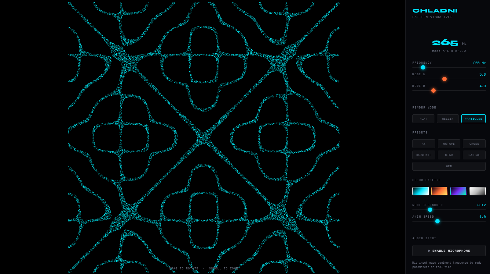

# Chladni Pattern Visualizer

A real-time WebGL visualizer of Chladni figures — the nodal patterns that form on a vibrating plate at resonant frequencies. Built with Vite + Three.js.



## What it does

The Chladni formula `z(x,y) = cos(nπx)·cos(mπy) − cos(mπx)·cos(nπy)` is evaluated per-vertex in a GLSL shader on a 512×512 plane mesh. Where `|z| ≈ 0`, nodal lines form — the places where sand would accumulate on a real vibrating plate.

## Features

- **3 render modes** — flat shader, 3D relief displacement, particle cloud on nodal lines
- **7 named presets** — snap to classic (n, m) pairs with a smooth GSAP-animated transition
- **4 color palettes** — cyan, fire, neon, monochrome
- **Mic input** — maps dominant microphone frequency to mode parameters in real time
- **OrbitControls** — drag to orbit, scroll to zoom, touch supported

## Tech stack

- [Vite](https://vitejs.dev/) — build tool and dev server
- [Three.js](https://threejs.org/) — WebGL renderer, ShaderMaterial, OrbitControls
- [GSAP](https://gsap.com/) — preset transition animations

## Run locally

```bash
npm install
npm run dev      # http://localhost:5173
npm run build    # production build → dist/
```

## Deploy to Netlify

Connect the GitHub repo in the Netlify dashboard — build settings are pre-configured in `netlify.toml`:

| Setting | Value |
|---|---|
| Build command | `npm run build` |
| Publish directory | `dist` |
| Node version | 20 |

Netlify auto-deploys on every push to `main`.
